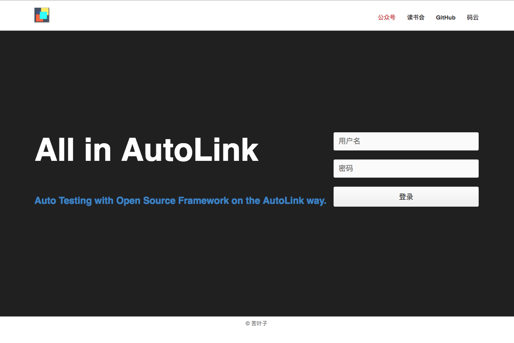
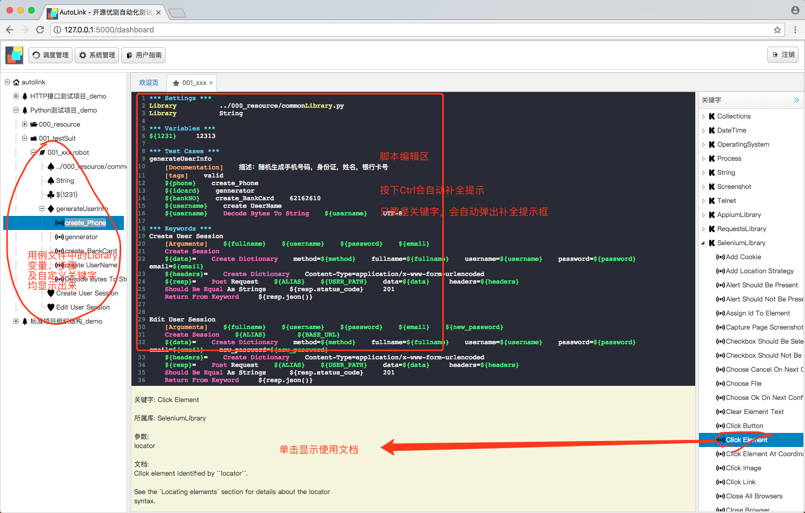
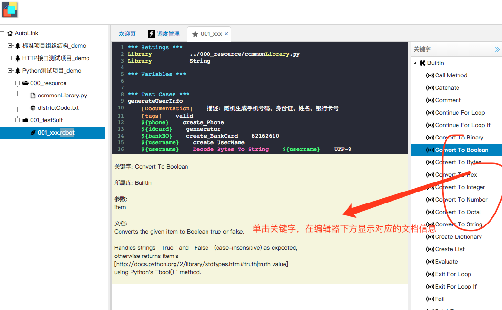
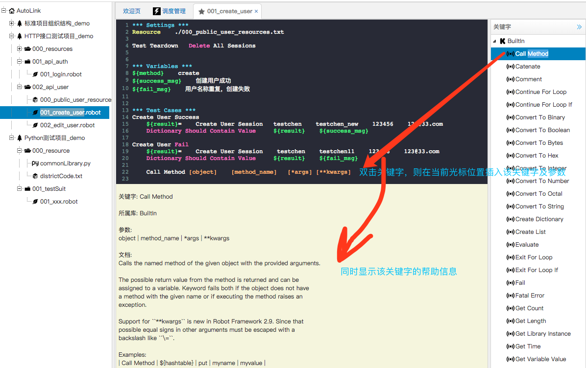
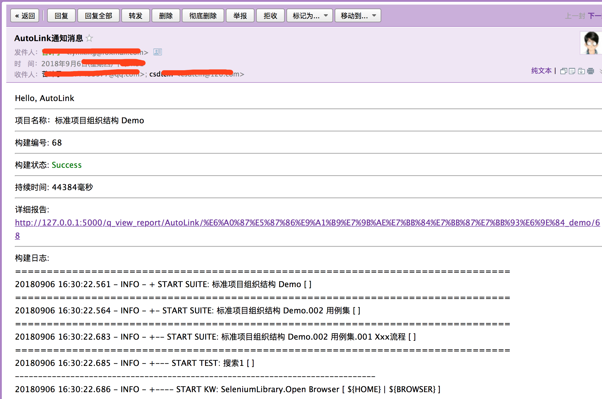

## bigface Project

#### 通过api直接执行 RF 或 pytest 的测试用例
* 直接执行RF的文件（suite）
```buildoutcfg
curl -H "Content-Type: application/json" -X POST -d '{"method": "api_rf", "category": "case", "apiuser": "charis", "key": "/Users/pi/PycharmProjects/bigface/project/DollarKV_test/TestCase/DT.robot" }' "http://localhost:8080/api/v1/task/"
{"result": "[  PASSED  ]", "passed": 3, "failed": 0, "log": "1635224066.6731892/log.html", "report": "1635224066.6731892/report.html"}
```
* 指定特定的 RF 的case
```buildoutcfg
curl -H "Content-Type: application/json" -X POST -d '{"method": "api_rf", "category": "case", "apiuser": "charis", "key": "/Users/pi/PycharmProjects/bigface/project/DollarKV_test/TestCase/DT.robot","case":"水电费1" }' "http://localhost:8080/api/v1/task/" 
{"result": "[  PASSED  ]", "passed": 1, "failed": 0, "log": "1635224393.212168/log.html", "report": "1635224393.212168/report.html"}
```
* 直接执行pytest 的测试文件
```buildoutcfg
curl -H "Content-Type: application/json" -X POST -d '{"method": "api_pytest", "category": "case", "apiuser": "charis", "key": "/Users/pi/PycharmProjects/bigface/project/DollarKV_test/TestCase/pytestdir/test_abc.py" }' "http://localhost:8080/api/v1/task/"
{"result": "[  PASSED  ]", "PASS": 4, "FAIL": 0, "log": "1635230160.839029/log.html"}
```
* 执行pytest特定的case 
```buildoutcfg
curl -H "Content-Type: application/json" -X POST -d '{"method": "api_pytest", "category": "case", "apiuser": "charis", "key": "/Users/pi/PycharmProjects/bigface/project/DollarKV_test/TestCase/pytestdir/test_abc.py::test_abcf1" }' "http://localhost:8080/api/v1/task/"
{"result": "[  PASSED  ]", "PASS": 1, "FAIL": 0, "log": "api_report/1635230756.99748/log.html"}
```
* 执行pytest特定测试类下的特定的测试函数
```buildoutcfg
curl -H "Content-Type: application/json" -X POST -d '{"method": "api_pytest", "category": "case", "apiuser": "charis", "key": "/Users/pi/PycharmProjects/bigface/project/DollarKV_test/TestCase/pytestdir/test_abc.py::Test_abcClass::test_abcC2" }' "http://localhost:8080/api/v1/task/"
{"result": "[  PASSED  ]", "PASS": 1, "FAIL": 0, "log": "api_report/1635230841.6304588/log.html"}
```

* 添加监控指标
```
curl -H "Content-Type: application/json" -X POST -d '{"method": "add_monitor", "script_conf": "ip@item.conf" }' "http://localhost:8081/api/v1/task_list/"
{"status": "success", "msg": "\u6dfb\u52a0\u76d1\u63a7\u6210\u529f:"}
```
####  RobotFramework WebUI for testers that can not use Local IDE for some reasons.
### Deeply Modified [AutoLink Github](https://github.com/small99/AutoLink)
* Update RF version support from 3.0 to 3.2。
* Support share projects , cooperate with one projects
* Fix bugs of highlight and autocomplete.
* Optimize KeyWords List to dynamic list.
* Add log to every action for reports and evaluation.
* Expand Project-Suite-Cases module to OS-dirs（Many level nested dirs）
* Add Different run mode，Cases-report，Executions-report ，all in right-pop menu.
* Add different load case methods:git, zip, execle-file. And export methods.

---
### The original AutoLink ReadMe：
AutoLink开源自动化测试集成解决方案.

- AutoLink是RobotFramework的web集成开发环境.
- AutoLink支持RobotFramework语法高亮，自动提示等功能.
- AutoLink可以帮助你轻易的构建web自动化测试脚本、HTTP接口自动化测试脚本以及移动自动化测试脚本.
- AutoLink完美的支持RobotFramework所有的关键字.
- AutoLink可以直接应用到你的企业实践中，节省框架开发成本.
- AutoLink是很简单的，但也很容易使用.
- AutoLink支持项目级、套件级、用例级运行

## UserGuide -- Translating and updating...

- [Introduction](./docs/README.md)
- [Installation and Start](./docs/安装与启动.md)
- [Create Project](./docs/如何创建测试项目.md)
- [Run Project](./docs/如何运行测试项目.md)
- [TestCase Order](./docs/如何管理测试项目中用例顺序.md)
- [Keywords usage](./docs/如何使用自动提示快捷输入关键字.md)
- [Keywords description](./docs/关键字概要说明.md)
- [Scheduler](./docs/如何使用调度管理.md)
- [Testcase Upload and Download](./docs/上传和下载RobotFramework用例.md)
- [Http API test](./docs/如何创建HTTP接口测试用例.md)
- [Check Keywords documentation](./docs/如何查看关键字详细文档.md)
- [Test Report](./docs/查看测试报告.md)
- [Config SMTP for mail](./docs/配置SMTP服务及邮件通知.md)


## Screen shot -- Updating ...

AutoLink Web IDE编辑模式截图欣赏









邮件通知截图

